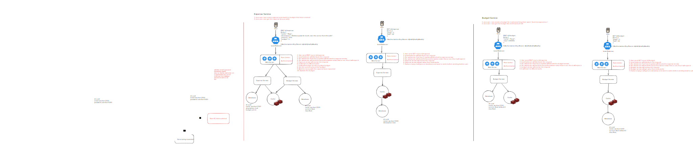

# Go Budget application
Budgetting application that could track expenses and setting up the budget of the user money

## How to run
First of all, please fill your db user and password into `env/config.json`

```bash
   go mod tidy
   go run cmd/server/main.go
```

# System Design


## Functional requirement
P0:
1. as a user, i can create a budget for track something that i want ( food, transporation )
2. as a user, i can create expense and mark it to budget that been created #1
3. as a user, i can get the expense list as a table
4. as a user, i can get the budget list, and how much left
5. as a user, i can register account and sign in

P1:
1. as a user, i can the notification if my expense exceed budget ( each category )
2. as a user, i can upload the photo / media to the expense created


Non-functional requirement
1. Uptime 99.9%
2. CAP Theorem -> Highly consistency
3. Scalability -> Auto scaling
4. Authentication -> Token based


## Quantity Analysis

Assumptions
1. 1 million daily users/day
2. Write average 3 expense per day
3. Write average 1 budget per day
4. Read 100:1 Write
5. Persistency: Data will be stores for 5 years


Calculations
1. Write per seconds: 1 * 10^6 / 24 * 60 * 60
   WPS = 10 per seconds
2. Read per seconds: 100 * 10 WPS = 1000 Read per seconds
3. Storage:
    - Budget -> metadata
        - per budget data: 4kb
        - for 5 years will store: 4kb * 1 * 10^6 * 350 ( days ) * 5
          4 * 10^3 * 10^6 * 1750
          7000 * 10^9
          7 * 10^12 = 7TB
    - Expense -> metadata
        - per expense: 4kb
        - For 5 years expense is 3 times budget: 7TB * 3 = 21TB


